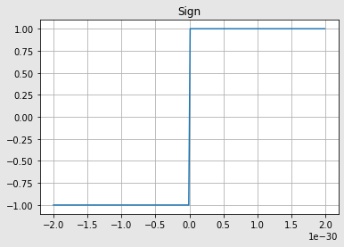

# Open Optimizers
Repository for open research on optimizers.  
This is a test in sharing research/exploration as it happens.  
If you use anything from this repository in your research please cite it.
  
If you want to contribute with experiments reach out here, on twitter or make a pull request.  

## Clamp SGD
[ClampSGD code](opopt/clampsgd.py)  
Vanilla SGD that clamps and scales the gradient of all parameters to the intervall [-1., 1.].  
It's a drop in replacement for your regular torch optimizer.  
Try it out and report your results if you want.  
  
So far ClampSGD has been used to finetune RGB networks, VQGAn and StyleGAN2/3 from CLIP with great results.
Performs best with clamp value of 1e-30 which almost turns it into a sign function.  
   
  
Examples of use can be found in the Structured Dreaming repository [https://github.com/ekgren/StructuredDreaming](https://github.com/ekgren/StructuredDreaming).  
  
TODO: Add documentation and explanations.  
TODO: Organized experiments.  
